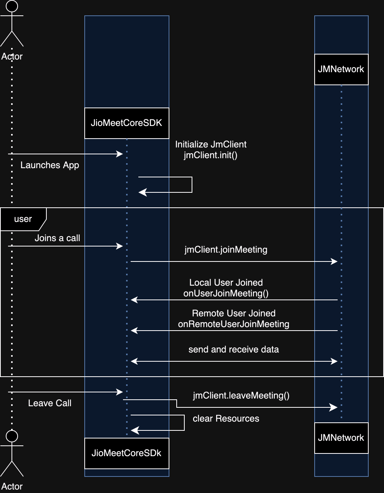

## Configure JioMeet Core SDK inside your app

- The `MainApplication` class, by extending `CoreApplication`, ensures that your application is correctly initialized to incorporate JioMeet Core SDK features seamlessly.

i. **Step 1** : Generate a Personal Access Token for GitHub

- Settings -> Developer Settings -> Personal Access Tokens -> Generate new token
- Make sure you select the following scopes (“ read:packages”) and Generate a token
- After Generating make sure to copy your new personal access token. You cannot see it again! The only option is to generate a new key.

ii. Update build.gradle inside the application module

```kotlin
    repositories {
    maven {
        credentials {
            <!--github user name-->
                username = ""
            <!--github user token-->
                password = ""
        }
        url = uri("https://maven.pkg.github.com/JioMeet/JioMeetCoreTemplateSDK_ANDROID")
    }
    google()
    mavenCentral()
}
```

iii. In Gradle Scripts/build.gradle (Module: <projectname>) add the CORE dependency. The dependencies
section should look like the following:

```gradle
dependencies {
    ...
    implementation "com.jiomeet.platform:jiomeetcoresdk:<version>"
    ...
}
```

Find the [Latest version](https://github.com/JioMeet/JioMeetCoreSDK_ANDROID/releases) of the Core
SDK and replace <version> with the one you want to use. For example: 2.1.8.

### Add permissions for network and device access.

In /app/Manifests/AndroidManifest.xml, add the following permissions after </application>:

```gradle
<uses-permission android:name="android.permission.READ_PHONE_STATE"/>
<uses-permission android:name="android.permission.INTERNET" />
<uses-permission android:name="android.permission.RECORD_AUDIO" />
<uses-permission android:name="android.permission.CAMERA" />
<uses-permission android:name="android.permission.MODIFY_AUDIO_SETTINGS" />
<uses-permission android:name="android.permission.ACCESS_WIFI_STATE" />
<uses-permission android:name="android.permission.ACCESS_NETWORK_STATE" />

<!-- The SDK requires Bluetooth permissions in case users are using Bluetooth devices. -->
<uses-permission android:name="android.permission.BLUETOOTH" />
<!-- For Android 12 and above devices, the following permission is also required. -->
<uses-permission android:name="android.permission.BLUETOOTH_CONNECT" />
```

### Requesting run time permissions

it's crucial to request some permissions like **_CAMERA ,RECORD_AUDIO, READ_PHONE_STATE_** at
runtime since these are critical device access permissins to ensure a seamless and secure user
experience. Follow these steps

1. Check Permissions

```kotlin
if (checkPermissions()) {
  // Proceed with using the features.
} else {
  // Request critical permissions at runtime.
}
```

2. Request Runtime Permissions:

```kotlin
private void requestCriticalPermissions() {
  ActivityCompat.requestPermissions(
    this,
    new String []{
      Manifest.permission.READ_PHONE_STATE,
      Manifest.permission.CAMERA,
      Manifest.permission.RECORD_AUDIO
    },
    PERMISSION_REQUEST_CODE
  );

}
```

3. Handle Permission Results

```kotlin
@Override
public void onRequestPermissionsResult(
  int requestCode,
  @NonNull String[] permissions,
  @NonNull int[] grantResults
) {
  if (requestCode == PERMISSION_REQUEST_CODE) {
    if (areAllPermissionsGranted(grantResults)) {
      // Proceed with using the features that require critical permissions.
    } else {
      // Handle denied permissions, especially for camera and phone state, which are essential.
    }
  }
}
```

---

### Initialisation

**For Core SDK Version `2.3.1` or before , please consult the [Hilt Setup Guide](./Hilt_support.md) to streamline the integration with Hilt.**

**For Core SDK Versions `3.0.0` and above we have removed hilt from JioMeetCoreSDk**, follow the below step in that case:

```kotlin
    class MainApplication : CoreApplication()
```

we will be initialise the JMClient

```kotlin
// Import the necessary classes and packages

// 1. Create an instance of JMClientViewModel by injecting it with JMClient as a dependency.

// Example of injecting JMClientViewModel using Hilt:
@HiltViewModel
class JMClientViewModel @Inject constructor(private val jmClient: JMClient) : ViewModel() {
  init {
    jmClient.init()
    // Perform other setup operations here if needed
  }
}

class YourActivity : AppCompatActivity() {
  private val jmClientViewModel: JMClientViewModel by viewModels()

  override fun onCreate(savedInstanceState: Bundle?) {
    super.onCreate(savedInstanceState)
    setContentView(R.layout.activity_your)

    // JMClientViewModel is created and initialized upon first access.
    // The JMClient initialization and other setup operations will be executed in the ViewModel's constructor.
  }
}
```

# Architecture


